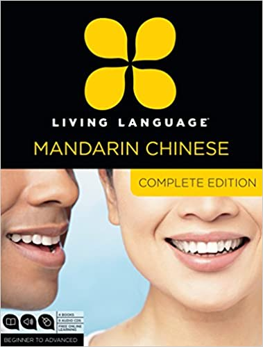

## Nǐ hǎo ma?

A fitting title for my first blog post!

So begins my venture into learning Mandarin! I am actually excited to begin 
learning a new language, partly because I also had a full physical course laying
about.

The course in question is Living Language Chinese Complete Edition. It comes
with four books (essential, intermediate, advanced, and a character guide) 
along with six audio CDs. Reviews for the Chinese course from Living 
Language seemed good too, though people tended to praise the older version 
more which is the one I have (I think).

Let's move on to what I have observed so far in learning 
this language, from Lesson 1 of the course.

## Observations

### Greetings

- Nǐ hǎo.
- Nǐ hǎo ma?
- Nǐ ne?

Nǐ must refer to the other person (you).

- Wǒ hěn hǎo.
- hěn hǎo

Hǎo must refer to the good state [of someone].

### Tones

There are five tones in Mandarin. You can tell how to pronounce each tone by 
simply looking at its shape.

**First tone**

ā

A flat, high pitched tone.

**Second tone**

á

A rising tone, from medium to high pitch.

**Third tone**

ǎ

A scooping tone, from low to medium pitch.

**Fourth tone**

à

A falling tone, similar to when you say "yes" or "no" in response to a 
question, or when you saying something you really mean.

**Fifth tone**

a

A neutral, medium pitched tone.

### Asking for help

- Qǐng ràng yī xià?
- Dǎrǎo yī xià?
- Qǐngwèn yī xià?

"yī xià" is probably used for those questions where you ask somebody for a 
favor or for an action from them.

"ma", on the other hand, is probably used to turn a phrase into a question.

### Hanzì strokes

Observations from Character Guide book, Lesson 1 — Basic Strokes.

**Héng**

As it sounds, is a horizontal line from left to right.

一

**Shù**

As it sounds, is a vertical line from top to bottom.

丨

**Piě**

Is like a curved shù that can be shallow or deep. The deep variant is shown 
below.

丿</>

**Diǎn**

Is sort of like a diagonal dot. Can be drawn from top left to bottom right 
or top right to bottom left. Essentially can only be drawn starting from the 
top.

丶

**Zhé**

Is like héng, but has a hook at the end.

乛

"hook" in pīnyīn is gōu. Therefore, zhé is also known as hénggōu.

## Conclusion
Well then, that concludes my initial observation and things learned in 
Mandarin. I'll be making more of these sorts of posts as I continue my 
learning journey.

I would appreciate any comments, corrections, and suggesstions!